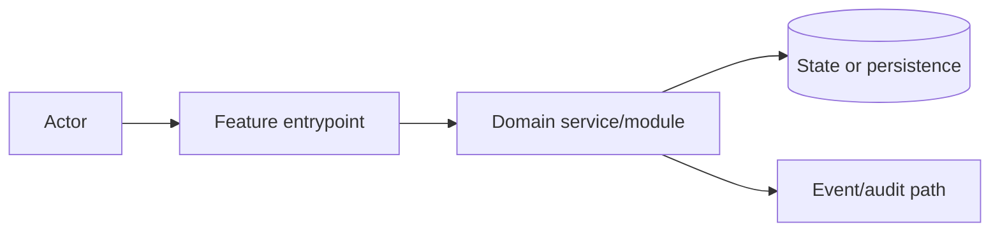

# Architecture: <Title>

## Change Delta
## System Context
## Component Interactions
## Feature Topology

## Diagrams
## Security Model
## Failure Modes
## Observability
## Rollback Strategy
## Migration Strategy
## Architecture Risks
## Alternatives Considered
## Shared Knowledge Impact

### Shared Knowledge Decision Table

| Knowledge file | Decision | Evidence | Future reuse |
| --- | --- | --- | --- |
| `.ai/knowledge/features-overview.md` | update / confirm unchanged / defer |  |  |
| `.ai/knowledge/architecture-overview.md` | update / confirm unchanged / defer |  |  |
| `.ai/knowledge/module-map.md` | update / confirm unchanged / defer |  |  |
| `.ai/knowledge/integration-map.md` | update / confirm unchanged / defer |  |  |
## Completeness Correctness Coherence
## ADRs
