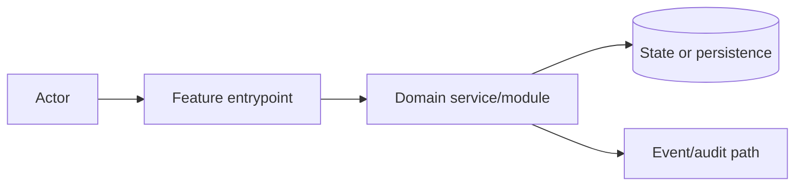

# Architecture: <Title>

## Change Delta
## System Context
## Component Interactions
## Feature Topology

## Diagrams
## Security Model
## Failure Modes
## Observability
## Rollback Strategy
## Migration Strategy
## Architecture Risks
## Alternatives Considered
## Shared Knowledge Impact
- `.ai/knowledge/features-overview.md`:
- `.ai/knowledge/architecture-overview.md`:
- `.ai/knowledge/module-map.md`:
- `.ai/knowledge/integration-map.md`:
## Completeness Correctness Coherence
## ADRs
