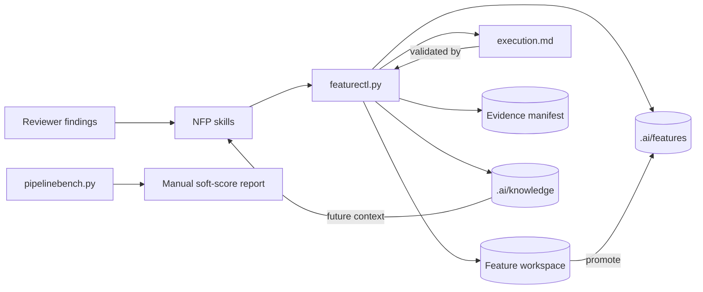

# Architecture: Artifact Readability And Execution Semantics

## Change Delta
This feature strengthens the artifact layer around `featurectl.py`, `pipelinebench.py`, `.ai/knowledge`, and `execution.md`. It keeps the current control-plane shape but adds explicit formatting, event-log, retry, profile category, and soft-score contracts.

## System Context
`featurectl.py` remains the deterministic pipeline control plane. It owns workspace creation, event logging, evidence completion, validation, promotion, index generation, and project profiling. `pipelinebench.py` owns benchmark reporting and candidate comparison. `.ai/knowledge` stores long-lived retrieval context for future agents.

## Component Interactions
`featurectl.py new` creates readable workspace artifacts. Gate/evidence commands append structured events to `execution.md`. Validation reads `execution.md`, `state.yaml`, evidence manifests, and profile docs. `pipelinebench.py score-run` reads hard-check results plus optional manual soft-score YAML and writes benchmark output. Finish/promotion writes canonical feature memory and updates ADR/knowledge docs.

## Feature Topology

## Diagrams
The topology shows that readable artifacts are not a presentation-only concern: event logging, evidence, knowledge retrieval, and benchmark scoring all depend on predictable artifact structure.

## Security Model
No secrets or auth flows are introduced. Manual soft-score files are local reviewer input and are not executed.

## Failure Modes
- Collapsed YAML/Markdown hides source-of-truth drift from human review.
- Gate events after current-state sections confuse future agents.
- Retry completion lines without attempt/reason make it unclear which evidence is authoritative.
- Generic detected signals from pipeline-lab distract agents during product feature context discovery.
- Soft scores remain placeholders and cannot compare prompt/skill power.

## Observability
Validation blockers name the affected file and violated structure. Benchmark reports include hard-check status, soft-score totals, rubric values, and comments. Discovered-signal docs explicitly label signal kind and source.

## Rollback Strategy
Revert feature commits. Existing canonical artifacts remain readable YAML/Markdown; if execution validation is too strict, revert only the execution-log validators and event writer changes.

## Migration Strategy
Migrate current pipeline execution logs into current-state/event-log/history shape. Update existing retry slice events with attempt and reason. Regenerate `.ai/knowledge` and update ADR index.

## Architecture Risks
- Strict execution-log validation may fail older artifacts until migrated.
- Formatting tests can be noisy if they scan external generated fixtures; scope them to source-controlled pipeline artifacts.
- Manual soft-score schema should be small enough to remain maintainable.

## Alternatives Considered
- Fully split `featurectl.py` first. Rejected for this pass because readability and event semantics are prerequisite contracts that should be stabilized before module extraction.
- Keep retry semantics as plain text. Rejected because future tools need attempt and reason to reason about authoritative completions.

## Shared Knowledge Impact
- `.ai/knowledge/architecture-overview.md`: deeper control-plane and artifact lifecycle sections.
- `.ai/knowledge/module-map.md`: clearer responsibilities for scripts, skills, artifacts, tests, and lab.
- `.ai/knowledge/integration-map.md`: benchmark/profile/promotion data flow.
- `.ai/knowledge/adr-index.md`: promoted decisions for read-only workspaces, canonical/discovered signal split, execution event semantics, and deterministic control-plane behavior.

## Completeness Correctness Coherence
The feature requirements align with the review findings and the latest lifecycle feature. Tests cover formatting, event structure, retry semantics, profile categories, benchmark scoring, and knowledge updates.

## ADRs
This feature will add ADR records under the canonical feature workspace and update `.ai/knowledge/adr-index.md`.
