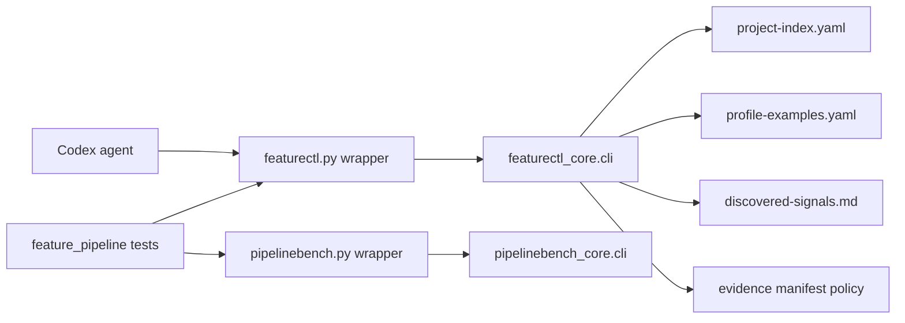

# Architecture: Clean Checkout Artifact Hygiene

## Change Delta

The change strengthens artifact hygiene at the generation, validation, and
source-layout layers without changing public command names.

## System Context

`featurectl.py` remains the Native Feature Pipeline control plane. The top-level
script becomes a wrapper and imports `.agents/pipeline-core/scripts/featurectl_core/cli.py`.
`pipelinebench.py` follows the same wrapper pattern with
`pipelinebench_core/cli.py`.

## Component Interactions

- `featurectl_core.cli` writes project profile and promotion artifacts.
- `.ai/knowledge/project-index.yaml` stores compact project retrieval memory.
- `.ai/knowledge/profile-examples.yaml` stores verbose path examples.
- `.ai/knowledge/discovered-signals.md` provides readable canonical and
  noncanonical signal blocks.
- Formatting tests validate both committed artifacts and generated artifacts.

## Feature Topology

## Diagrams

The topology diagram above is the high-level module communication view.

## Security Model

No secret handling changes. The clean-checkout validation must not run network
commands by default.

## Failure Modes

- Wrapper import path mistakes can break all CLI tests.
- Moving examples out of `project-index.yaml` can break agents/tests that still
  assume example arrays live in the index.
- Overly strict evidence policy can reject valid semantic labels.

## Observability

Failures are visible through `featurectl.py validate`, pytest output, and
formatting/readability test failures.

## Rollback Strategy

Revert the wrapper split and profile rendering changes. Existing feature memory
remains readable because the promoted artifacts are plain YAML and Markdown.

## Migration Strategy

Backfill existing `.ai/knowledge/profile-examples.yaml`, update existing
discovered signals rendering, and add policy metadata to manifests that already
contain change-label-only slices.

## Architecture Risks

- A thin wrapper split reduces top-level script size but does not fully isolate
  all featurectl responsibilities.
- `project-index.yaml` consumers may need to read `profile-examples.yaml` for
  source/test/doc examples.

## Alternatives Considered

- Keep all examples in `project-index.yaml`. Rejected because it keeps context
  memory dense and noisy.
- Backfill fake `diff_hash` values for legacy change labels. Rejected because it
  would misrepresent semantic labels as hashes.

## Shared Knowledge Impact

- `.ai/knowledge/project-index.yaml` becomes smaller and safer for context.
- `.ai/knowledge/profile-examples.yaml` becomes the source for verbose examples.
- `.ai/knowledge/discovered-signals.md` becomes easier to scan.
- `.ai/knowledge/architecture-overview.md` should mention wrapper/core module
  layout after promotion.

## Completeness Correctness Coherence

The design connects each review finding to either a guard, a generation change,
or an explicit legacy policy. Stale public-formatting observations are handled
by validation rather than by assuming they are true.

## ADRs

No separate ADR file is required for this narrow hygiene feature. The feature
card will record the wrapper split and profile split decisions.
