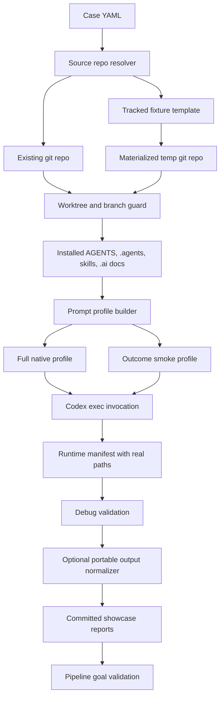

# Architecture: Codex E2E Runner Hardening

## Change Delta

The Codex E2E/debug runner architecture gains four boundaries:

- a source resolver that supports existing repos and tracked fixture templates
- a worktree/branch safety guard that blocks destructive reruns unless explicit
- a prompt profile selector for full native runs and bounded real smoke runs
- a portable report normalizer that runs only after actual path validation

## System Context

The feature lives inside the harness repository and exercises external or
fixture repositories through `git worktree` plus `codex exec`. The harness owns
pipeline context installation, run metadata, deterministic validation, and
committed showcase reports.

Source evidence:

- `pipeline-lab/showcases/scripts/run_codex_e2e_case.py`: builds prompts,
  prepares git worktrees, invokes Codex, and writes per-case manifests.
- `pipeline-lab/showcases/scripts/run_codex_debug_pipeline.py`: wraps the E2E
  runner in mock, dry-run, or real mode and validates generated artifacts.
- `pipeline-lab/showcases/scripts/validate_pipeline_goals.py`: validates
  committed showcase outputs against the vision and plan.
- `tests/feature_pipeline/test_codex_e2e_runner.py`: focused E2E runner tests.
- `tests/feature_pipeline/test_codex_debug_runner.py`: focused debug wrapper
  tests.
- `AGENTS.md`: requires native pipeline discovery through repository context,
  not direct nested prompts that enumerate every internal skill.

## Component Interactions

- Case configuration feeds `run_codex_e2e_case.py`.
- The E2E runner resolves either `original_codebase.repo_path` or
  `original_codebase.template_path` into a git repository.
- The E2E runner guards branch/worktree replacement before destructive git
  commands.
- The E2E runner installs local pipeline context, selects a prompt profile, runs
  Codex or dry-run, and writes manifests.
- The debug runner validates real paths first, then optionally rewrites output
  files to portable path tokens for committed artifacts.
- The pipeline goal validator checks committed debug output for status,
  artifacts, real-mode diagnostic evidence, and local path leakage.

## Feature Topology

## Diagrams

The feature topology diagram above is the canonical high-level service/module
communication diagram for this feature. No separate deployment diagram is
required because all components are local scripts and generated artifacts.

## Security Model

- No credentials are introduced.
- `codex exec --dangerously-bypass-approvals-and-sandbox` remains explicit in
  generated command metadata.
- Source materialization uses tracked fixture files only.
- Worktree replacement becomes opt-in so an accidental rerun cannot delete a
  branch or worktree without an explicit flag.

## Failure Modes

- Existing branch/worktree without replacement: fail fast with a clear message.
- Invalid case with both `repo_path` and `template_path`: fail fast.
- Codex timeout: preserve timeout metadata and output.
- Portable normalization attempted before validation: rejected by design because
  normalization is called after summaries are validated.

## Observability

- Per-case `run.yaml` records execution mode, prompt profile, source repo kind,
  timeout, return code, before/after HEAD, and artifact paths.
- Debug `summary.yaml` records validation results, weaknesses, comparison with
  existing unit tests, and portable path mode when enabled.
- `validation.md` and `comparison.md` remain human-readable review artifacts.

## Rollback Strategy

- Revert the implementation commit to restore previous runner behavior.
- Existing case files remain compatible because `repo_path` and the default
  `full-native` prompt profile keep current behavior.
- If portable output causes a problem, rerun without `--portable-output`.

## Migration Strategy

No data migration is required. Existing debug commands continue to work unless
they implicitly rely on destructive replacement; those commands must add
`--replace-existing-worktree` directly or use debug `--clean`.

## Architecture Risks

- Fixture materialization could diverge from real repo behavior. Mitigation:
  fixture support is used for smoke reproducibility, while the ten original
  real-codebase cases remain.
- Portable reports could hide absolute path context. Mitigation: runtime
  validation consumes actual paths before normalization and run metadata records
  `path_mode`.
- A bounded prompt profile could be mistaken for full native validation.
  Mitigation: prompt profile is explicit in manifests and reports.

## Alternatives Considered

- Keep only fake Codex tests: rejected because it does not prove real executable
  invocation or completion behavior.
- Always delete worktrees for reproducibility: rejected because it is too
  destructive for everyday local validation.
- Track initialized fixture `.git` directories: rejected because template
  materialization is cleaner and portable.

## Shared Knowledge Impact

### Shared Knowledge Decision Table

| Knowledge file | Decision | Evidence | Future reuse |
| --- | --- | --- | --- |
| `.ai/knowledge/features-overview.md` | update | Feature-card and validation artifacts. | Future agents can find the real-smoke and portable-output capability. |
| `.ai/knowledge/architecture-overview.md` | update | Mermaid topology in this artifact. | Future agents can reason about source resolution, worktree guard, prompt profiles, and portable reporting. |
| `.ai/knowledge/module-map.md` | update | Changed files and focused tests. | Future work can extend cases without rediscovering ownership. |
| `.ai/knowledge/integration-map.md` | update | Debug runner summary and real-mode diagnostic. | Future validation can distinguish mock, dry-run, and real Codex runs. |

## Completeness Correctness Coherence

- Completeness: covers source resolution, worktree safety, prompt profiles,
  portable reporting, validation, tests, and showcase regeneration.
- Correctness: destructive operations require explicit intent, and validation
  happens before path normalization.
- Coherence: changes are scoped to runner scripts, validators, fixtures, tests,
  and generated debug artifacts.

## ADRs

- ADR-001: Use template-path source materialization for stable real-smoke
  fixtures instead of committing nested git repositories.
- ADR-002: Default worktree replacement is refused; explicit flags restore the
  previous behavior only when requested.
- ADR-003: Portable output normalization is a debug-runner post-validation
  concern, not an E2E runtime manifest concern.

