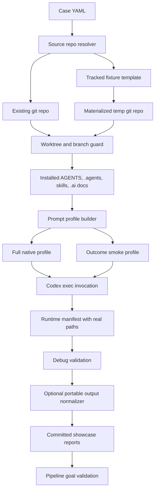

# Architecture: Codex E2E Runner Hardening

## Source Evidence

- `pipeline-lab/showcases/scripts/run_codex_e2e_case.py`: builds prompts,
  prepares git worktrees, invokes Codex, and writes per-case manifests.
- `pipeline-lab/showcases/scripts/run_codex_debug_pipeline.py`: wraps the E2E
  runner in mock, dry-run, or real mode and validates generated artifacts.
- `pipeline-lab/showcases/scripts/validate_pipeline_goals.py`: validates
  committed showcase outputs against the vision and plan.
- `tests/feature_pipeline/test_codex_e2e_runner.py`: focused E2E runner tests.
- `tests/feature_pipeline/test_codex_debug_runner.py`: focused debug wrapper
  tests.
- `AGENTS.md`: requires native pipeline discovery through repository context,
  not direct nested prompts that enumerate every internal skill.

## Feature Topology

## Module Communication

- Case configuration feeds `run_codex_e2e_case.py`.
- The E2E runner resolves either `original_codebase.repo_path` or
  `original_codebase.template_path` into a git repository.
- The E2E runner guards branch/worktree replacement before any destructive git
  command is attempted.
- The E2E runner installs the local pipeline context, selects a prompt profile,
  runs Codex or dry-run, and writes manifests.
- The debug runner validates real paths first, then optionally rewrites output
  files to portable path tokens for committed artifacts.
- The pipeline goal validator checks the committed debug run for status,
  artifact validation, real-mode diagnostic evidence, and absence of local path
  leakage.

## Shared Knowledge Impact

| Knowledge File | Decision | Evidence | Future reuse |
| --- | --- | --- | --- |
| `.ai/knowledge/features-overview.md` | Add the hardening as canonical pipeline memory after finish. | Feature-card and validation artifacts. | Future agents can find the real-smoke and portable-output capability. |
| `.ai/knowledge/module-map.md` | Preserve runner/test boundaries under `pipeline-lab/showcases/scripts` and `tests/feature_pipeline`. | Changed files and test commands. | Future work can extend cases without rediscovering ownership. |
| `.ai/knowledge/architecture-overview.md` | Record the E2E runner topology as a repeatable debug architecture. | Mermaid topology in this artifact. | Future agents can reason about source resolution, worktree guard, prompt profiles, and portable reporting. |
| `.ai/knowledge/integration-map.md` | Capture Codex CLI invocation as an external integration with mock, dry-run, and real modes. | Debug runner summary and real-mode diagnostic. | Future validation can distinguish tests from real Codex runs. |

## Risks

- Rewriting runtime paths too early would break validation. Mitigation: validate
  before portable normalization.
- Fixture materialization could hide source repo dirtiness. Mitigation:
  materialized repos are created from tracked templates and committed cleanly
  before normal runner checks.
- Real Codex smoke can still time out on local machines. Mitigation: the smoke
  profile is intentionally bounded and timeout metadata remains explicit.

