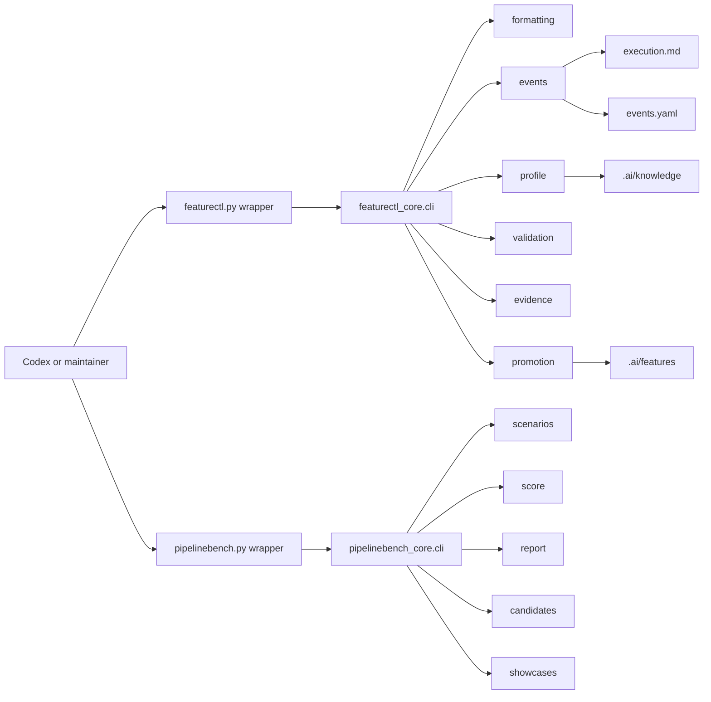

# Architecture: Core Modularity And Readable Events

## Change Delta

This feature preserves public CLI behavior while splitting implementation
responsibility out of the largest core files and adding stronger validation for
readable, parseable pipeline memory.

## System Context

`featurectl.py` and `pipelinebench.py` are stable wrappers. Their current core
modules still hold too many responsibilities. The refactor introduces cohesive
support modules while keeping command dispatch compatible.

## Component Interactions

- `featurectl_core.cli` remains the command parser and dispatch layer.
- `featurectl_core.formatting` owns YAML, text, and Markdown formatting helpers.
- `featurectl_core.events` owns execution event rendering and `events.yaml`
  sidecar updates.
- `featurectl_core.profile` owns project profiling and knowledge rendering.
- `featurectl_core.validation` owns workspace and artifact validation helpers.
- `featurectl_core.evidence` owns evidence manifests and slice completion.
- `featurectl_core.promotion` owns feature index and canonical promotion
  helpers.
- `pipelinebench_core.scenarios` owns scenario constants and initialization.
- `pipelinebench_core.score` owns scoring and hard checks.
- `pipelinebench_core.report` owns report rendering.
- `pipelinebench_core.candidates` owns candidate path isolation.
- `pipelinebench_core.showcases` owns showcase comparison behavior.

## Feature Topology

## Diagrams

The topology shows stable wrappers at the edge and smaller core modules behind
them. Machine-readable event history is added beside `execution.md` so future
benchmarks can parse history without scraping prose.

## Security Model

No credentials, network secrets, public APIs, or production data are touched.
The one-time raw verification uses public GitHub URLs and is stored as evidence,
not as a test dependency.

## Failure Modes

- Refactoring may introduce circular imports if modules share too many helpers.
- Event sidecar creation may drift from `execution.md` unless both are written
  by the same helper.
- Stricter Markdown readability tests may flag generated raw command logs unless
  scoped to curated documentation only.
- Clean-clone checks can be slow, so they stay in evidence instead of the normal
  test suite.

## Observability

Failures appear in pytest, `featurectl.py validate`, public raw evidence logs,
and final verification output under this feature workspace.

## Rollback Strategy

Revert the feature commits. The public wrappers and previous canonical memory
remain valid; rollback only restores the larger core modules and current
event-log behavior.

## Migration Strategy

New feature workspaces get `events.yaml` at creation. Existing canonical
features are not rewritten except for the current feature memory produced by
this run.

## Architecture Risks

- Keeping command functions in `cli.py` during an intermediate split may still
  leave `cli.py` larger than ideal. The test threshold should force meaningful
  reduction without demanding a risky full rewrite in one pass.
- Event sidecars add another artifact to validate. The validation rules must
  keep it lightweight and optional for legacy workspaces.

## Alternatives Considered

- Full rewrite of `featurectl_core.cli` into command modules in one change.
  Rejected as too risky for a control plane with broad existing test coverage.
- Keep only key-value Markdown events. Rejected because future tooling needs a
  parseable event source.
- Add `black`. Rejected for this feature because the repo currently avoids a
  formatter dependency and already has no-dependency readability checks.

## Shared Knowledge Impact

- `.ai/knowledge/architecture-overview.md` should mention `events.yaml` and the
  module split.
- `.ai/knowledge/module-map.md` should list the new core modules.
- `.ai/knowledge/integration-map.md` should describe `execution.md` plus
  `events.yaml`.

## Completeness Correctness Coherence

Each remaining review finding maps to either one-time public verification,
module extraction, a new regression test, or a documented follow-up boundary.

## ADRs

No standalone ADR is required. The feature card will record the event sidecar
and module-split decisions as feature memory.
