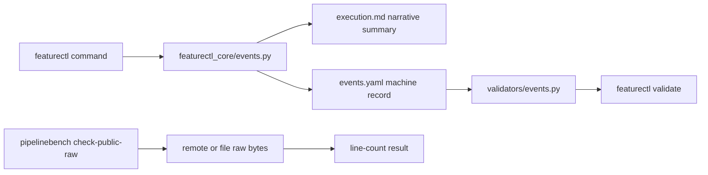

# Architecture: Event Schema Strictness And Narrative Execution Logs

## Change Delta

This feature tightens the event sidecar contract and moves generated execution
log entries toward narrative summaries. It also adds a benchmark command for
explicit public raw byte checks.

## System Context

`featurectl.py` mutates feature workspaces. It writes `execution.md` for humans
and `events.yaml` for machines. `pipelinebench.py` scores or checks pipeline
artifacts outside the feature workspace lifecycle.

## Component Interactions

- `featurectl_core/events.py` renders narrative event summaries and writes
  parseable sidecar records.
- `featurectl_core/validators/events.py` validates the strict event contract.
- `schemas/events.schema.json` documents the event contract.
- `pipelinebench_core` adds a public raw check command for remote or local raw
  artifact bytes.
- Tests exercise the behavior through public CLI wrappers.

## Feature Topology

`events.yaml` is the durable machine event source. `execution.md` is the human
journal. Commands write both, but only `events.yaml` carries structured fields.

## Diagrams

## Security Model

The feature adds no credentials and no network access to normal validation.
`pipelinebench check-public-raw` performs explicit user-requested fetches only.

## Failure Modes

- Unknown event types should fail validation with a precise event index.
- Unexpected event fields should fail validation.
- Public raw checks should fail when a path has too few newline bytes.
- Network failures should fail the explicit raw check command without affecting
  local offline tests.

## Observability

Validation failures are CLI-readable. Benchmark raw checks print one line per
checked path and a final pass/fail summary.

## Rollback Strategy

Revert the feature commits. Existing feature artifacts remain readable because
the changes are additive around validation and rendering.

## Migration Strategy

New event records follow the stricter schema. Historical canonical logs are not
rewritten unless directly touched by this feature.

## Architecture Risks

- Over-tightening event fields could reject current records. This is mitigated by
  deriving allowed fields from existing event shapes.
- Narrative logs could hide information from humans. This is mitigated by keeping
  `events.yaml` visible in `apex.md`.

## Alternatives Considered

- Keep permissive event schema: rejected because it weakens machine validation.
- Require live GitHub raw checks in tests: rejected because tests must be offline.
- Move execution events entirely out of `execution.md`: deferred to avoid a large
  historical artifact migration.

## Shared Knowledge Impact

- `.ai/knowledge/architecture-overview.md` should describe strict event schema
  validation and narrative execution logs.
- `.ai/knowledge/module-map.md` should mention raw check ownership if promoted.
- `.ai/knowledge/integration-map.md` should keep the execution/event sidecar
  boundary explicit.

## Completeness Correctness Coherence

The design keeps a single machine source of truth while preserving human
readability. Validation and schema changes are tested through CLI-visible
fixtures.

## ADRs

- ADR candidate: strict events sidecar schema and narrative execution boundary.

