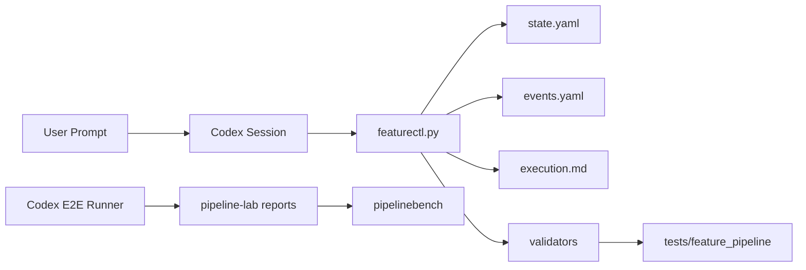

# Architecture: Execution Safety Guardrails

## Change Delta

New guardrails are added around real Codex e2e tests, state transitions, gate
dependencies, active event sidecars, Docs Consulted evidence, worktree status,
dirty base checkout handling, and CI coverage.

Modified modules include `featurectl_core.cli`, `featurectl_core.validation`,
focused validators, e2e tests, pipelinebench runner reporting, manual-check
docs, and the guardrail workflow.

No existing canonical feature memory format is removed. Legacy inactive
artifacts keep migration tolerance.

## System Context

`featurectl.py` remains the deterministic control plane. It owns state mutation,
gate mutation, worktree inspection, validation, and generated machine artifacts.
Skills and Codex sessions write narrative planning content, then use
`featurectl.py` for machine state.

## Component Interactions

- CLI commands read `feature.yaml`, `state.yaml`, `execution.md`, and
  `events.yaml`.
- Validators inspect artifacts and report blockers without mutating narrative
  files.
- Tests create fixture repositories and call wrappers exactly as users do.
- Manual preflight scripts call status, validation, worktree status, and
  implementation readiness separately.

## Feature Topology

## Diagrams

The topology shows the control flow from user intent to Codex, deterministic
state mutation, validation, and regression tests. Machine event detail belongs
in `events.yaml`; the human operational journal remains `execution.md`.

## Security Model

The security boundary is procedural: no implementation before approved or
delegated planning gates, dirty base checkouts must be acknowledged, and
under-specified security-sensitive prompts must stop for clarification rather
than producing full implementation plans from assumptions.

## Failure Modes

- A real e2e test can pass while validating from the wrong directory.
- A planning-only prompt can accidentally change product code.
- A caller can jump state directly to verification.
- A caller can approve downstream gates before upstream gates.
- An active workspace can lack `events.yaml`.
- `worktree-status` can report failure because implementation readiness is
  blocked, even though the worktree is valid.
- Docs Consulted can reference multiple paths with only one use explanation.

## Observability

Each command failure should print deterministic blockers. Real e2e tests retain
prompt logs, Codex output, workspace tree, validation output, and git diff. The
CI workflow reports wrapper help, compile checks, raw checks, formatting tests,
and the deterministic feature pipeline suite.

## Rollback Strategy

Each slice is isolated by test coverage. If legal transition enforcement or gate
dependencies block existing valid flows, revert the specific dependency check
while preserving real e2e source-diff assertions and active `events.yaml`
requirements.

## Migration Strategy

Active workspaces created after this feature must include `events.yaml`.
Promoted-readonly, archived, abandoned, and canonical legacy artifacts remain
tolerant until a separate historical migration is run.

## Architecture Risks

- Gate dependency enforcement in `gate set` may duplicate validation logic.
- The real Codex e2e must avoid brittle language assertions while still proving
  safety.
- Docs Consulted parsing needs to support existing bullet-style entries and the
  newer keyed style.

## Alternatives Considered

- Only document legal transitions in skills: rejected because state mutation
  should be tool-enforced.
- Keep `worktree-status` as implementation readiness: rejected because planning
  worktrees need an isolation check before implementation gates are approved.
- Require `events.yaml` for all canonical historical artifacts immediately:
  rejected because this feature is about active execution safety, not a global
  migration.

## Shared Knowledge Impact

- `.ai/knowledge/architecture-overview.md`: should mention state/gate mutation
  safety and the worktree/readiness split after promotion.
- `.ai/knowledge/testing-overview.md`: should mention real Codex e2e layers and
  deterministic full-suite CI coverage.
- `.ai/knowledge/module-map.md`: should list validator ownership boundaries for
  state, events, execution log, worktree, gates, slices, and docs consulted.
- `.ai/knowledge/integration-map.md`: should mention CI public raw and full
  deterministic pipeline test checks.

## Completeness Correctness Coherence

The feature ties user-visible workflow safety to deterministic CLI enforcement,
tests every new guardrail with focused fixtures, and leaves historical artifact
migration as explicit backlog rather than changing unrelated records.

## ADRs

- ADR-012 records the decision to enforce state and gate ordering in
  `featurectl.py` rather than relying only on skill prose.
