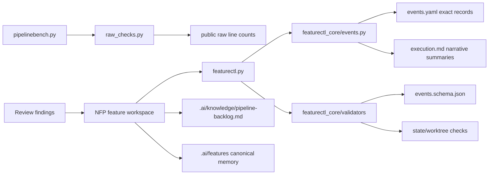

# Architecture: Guardrail Polish And Backlog Tracking

## Change Delta

This change strengthens the existing control plane rather than introducing a
new pipeline. It adds durable guardrails around already fixed public raw and
formatting issues, tightens the event sidecar contract, narrows
`execution.md` to a human narrative, and moves more validation code into
focused modules.

## System Context

The affected system is the repository-local Native Feature Pipeline:

- `featurectl.py` remains the stable control-plane wrapper.
- `featurectl_core` owns workspace state, event sidecars, formatting,
  validation, evidence, and promotion.
- `pipelinebench.py` remains the stable benchmark wrapper.
- `pipelinebench_core/raw_checks.py` owns explicit public raw line-count checks.
- `.ai/features` and `.ai/knowledge` are the long-term retrieval layers.

## Component Interactions

`featurectl_core/events.py` receives event records from CLI commands. It writes
exact event records into `events.yaml` and appends concise human summaries into
`execution.md`. Validators check both artifacts with different responsibilities:
`events.yaml` is schema-like machine evidence, while `execution.md` is a
reviewable journal.

`pipelinebench_core/raw_checks.py` verifies physical raw file line counts
without executing remote content. A GitHub Actions workflow can run the raw
check against the pushed commit URL, while local tests continue to validate
source-controlled bytes offline.

## Feature Topology

The feature follows the existing control-plane topology:

1. `pipelinebench.py` exposes permanent raw guardrail command coverage.
2. `featurectl_core/formatting.py` continues writing block-style YAML.
3. `featurectl_core/events.py` writes exact events and human summaries.
4. `featurectl_core/validators/*` checks schema, state, execution, and
   worktree concerns.
5. Promotion updates `.ai/features` and `.ai/knowledge`.

## Diagrams

## Security Model

No secrets or credentials are introduced. The public raw check fetches text
content for line counting only and does not execute fetched code. GitHub
Actions uses checkout and Python test commands with no privileged tokens beyond
normal repository read access.

## Failure Modes

- Public raw check network failure: CI fails visibly; local byte checks still
  protect committed files.
- Event schema too strict: featurectl validation reports the exact unexpected
  field or missing required field.
- Execution summary too terse: exact data remains recoverable from
  `events.yaml`.
- Validator split regression: focused tests keep blocker messages stable.

## Observability

Evidence is captured through test output logs in `evidence/`. The new backlog
file gives future agents a single retrieval point for accepted deferred work.
`events.yaml` remains the exact event source of truth for parsing and audit.

## Rollback Strategy

Each slice can be reverted independently:

- CI/raw guardrail additions can be removed without changing runtime behavior.
- Event schema top-level strictness can be relaxed by removing the schema
  property and validator assertion.
- Execution summary changes can fall back to prior summary strings while
  preserving `events.yaml`.
- Validator module extraction can be reverted by moving imports back into
  `validation.py`.

## Migration Strategy

No data migration is required. Existing canonical features remain valid. The
new stricter checks apply to newly written artifacts and to canonical files that
are already part of the readable artifact contract.

## Architecture Risks

- `validation.py` imports can become circular if extracted modules depend on
  orchestration helpers.
- GitHub Actions raw checks can fail before raw content is visible for a new
  push; using the commit SHA reduces branch-cache ambiguity.
- Backlog duplication is possible if feature cards and central backlog diverge;
  finish guidance should cite the central file.

## Alternatives Considered

- Put all guardrails only in tests: rejected because public raw behavior should
  also be executable as a durable command and CI check.
- Make `execution.md` fully generated from `events.yaml`: rejected for now
  because skills still write human context and docs consulted entries there.
- Split all validation modules in one pass: rejected to avoid a large risky
  refactor in a polish feature.

## Shared Knowledge Impact

Promotion should update:

- `.ai/knowledge/architecture-overview.md` with the narrative/event boundary.
- `.ai/knowledge/module-map.md` with new validator module ownership.
- `.ai/knowledge/integration-map.md` with the CI/raw guardrail path.
- `.ai/knowledge/pipeline-backlog.md` with deferred migration and showcase
  separation work.

## Completeness Correctness Coherence

The design keeps machine and human artifacts separate, makes recurrent raw
issues permanent guardrails, and limits modularization to focused validators so
the change is reviewable. The feature is complete when tests prove the new
constraints and the promoted feature validates from a clean checkout.

## ADRs

- ADR-008 will record that public raw checks are permanent guardrails and that
  `execution.md` is a narrative summary, not the exact event source.
