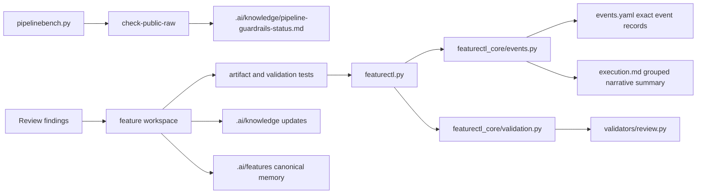

# Architecture: Guardrail Status And Summary Polish

## Change Delta

This feature strengthens existing guardrails rather than adding a new pipeline.
It adds a durable guardrail status document, makes promoted execution summaries
semantic, tightens generated-artifact readability checks, and moves review
validation into a focused module.

## System Context

The Native Feature Pipeline is repository-local. `featurectl.py` remains the
stable wrapper while `featurectl_core` owns deterministic state, event,
validation, evidence, and promotion mutations. `pipelinebench.py` remains the
benchmark wrapper and already exposes `check-public-raw`.

## Component Interactions

`featurectl_core/events.py` writes exact records into `events.yaml` and human
summaries into `execution.md`. Promotion can derive a compact event summary from
the sidecar after the canonical copy is written.

`featurectl_core/validation.py` orchestrates validation. Focused modules under
`featurectl_core/validators/` own specific validation domains; review artifact
checks move into `validators/review.py`.

`.ai/knowledge/pipeline-guardrails-status.md` becomes the retrieval anchor for
public raw and CI guardrail status. `module-map.md`, `integration-map.md`, and
`architecture-overview.md` reference it.

## Feature Topology

The change uses the existing file-based topology:

1. CI and local commands verify wrapper execution, compile checks, artifact
   formatting, and public raw line counts.
2. Promotion writes exact events to `events.yaml`.
3. Promotion rewrites canonical `execution.md` into grouped event summaries.
4. Validation reads focused modules and shared knowledge to prove consistency.

## Diagrams

## Security Model

No credentials or secret handling changes are introduced. Public raw checks
count fetched text lines and do not execute remote content. Offline tests remain
file-backed.

## Failure Modes

- Public raw endpoint is stale: local tests still validate physical file bytes,
  and CI uses commit-specific raw URLs.
- Execution summary loses detail: `events.yaml` remains the machine source of
  truth.
- Validator extraction regresses errors: existing review and verification tests
  must keep blocker text stable.
- YAML checks become too broad: tests should target generated canonical YAML and
  known workflow files only.

## Observability

Reviewers can inspect `.ai/knowledge/pipeline-guardrails-status.md`,
`events.yaml`, test output evidence, and the promoted feature card. The
guardrail workflow and public raw command remain executable proof.

## Rollback Strategy

Revert slices independently:

- Remove the status document and knowledge references.
- Revert execution-summary compaction to per-event summaries.
- Move review validation helpers back into `validation.py`.
- Relax the new artifact-formatting tests.

## Migration Strategy

No data migration is required. New promotions get compact event summaries.
Historical canonical execution logs are left unchanged unless migrated by a
future backlog item.

## Architecture Risks

- Summary compaction must not mutate or drop `events.yaml`.
- The promotion path must handle features without complete sidecars.
- Validation extraction must not introduce circular imports from validators back
  into orchestration.

## Alternatives Considered

- Publish a README badge only: rejected because future agents read `.ai/knowledge`
  more consistently than README status badges.
- Rewrite all historical execution logs now: rejected as a risky broad migration.
- Split all validation domains now: rejected because review validation is the
  scoped next module with concrete current findings.

## Shared Knowledge Impact

Promotion updates:

- `.ai/knowledge/pipeline-guardrails-status.md`
- `.ai/knowledge/architecture-overview.md`
- `.ai/knowledge/module-map.md`
- `.ai/knowledge/integration-map.md`
- `.ai/knowledge/pipeline-backlog.md`

## Completeness Correctness Coherence

The design keeps the exact event stream in one machine artifact while improving
human readability. It also turns the repeated public raw uncertainty into a
retrievable guardrail status, backed by permanent tests and CI commands.

## ADRs

- ADR-009 records guardrail status as shared knowledge and promotion-time
  execution summary compaction.
