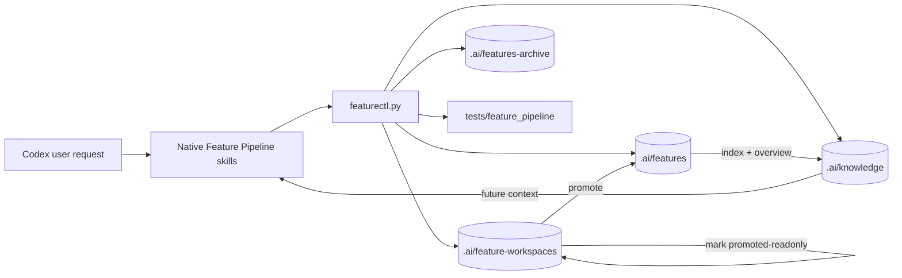

# Architecture: Lifecycle Hygiene And Profile Noise

## Change Delta
New lifecycle metadata distinguishes active feature workspaces from promoted read-only workspaces. Validation gains execution-log structure checks and duplicate slice event checks. Project profiling writes discovered signals into a separate generated document. Root policy and legacy reference docs are clarified.

## System Context
`featurectl.py` is the deterministic control plane. It creates workspaces, records evidence, validates readiness/finish state, promotes canonical memory, regenerates feature indexes, and profiles repository knowledge. `.ai/features` is canonical memory; `.ai/feature-workspaces` is run memory; `.ai/knowledge` is generated retrieval context.

## Component Interactions
Promotion writes canonical memory, updates the source workspace lifecycle, regenerates the canonical index/overview, and rewrites latest status. Validation checks repository-wide source truth whenever any workspace is validated. Profiling reads tracked files and writes generated `.ai/knowledge` documents.

## Feature Topology

## Diagrams
The topology shows the high-level communication between skills, `featurectl.py`, workspace memory, canonical memory, archive memory, generated knowledge, and validation tests.

## Security Model
No credential or auth model changes are introduced. The main safety property is preventing stale workspace data from being mistaken for active feature context.

## Failure Modes
- A promoted workspace without lifecycle metadata could be reused as active context.
- A stale execution log could lead a future agent to resume the wrong step.
- Duplicate slice events could hide accidental re-completion or evidence mutation.
- Generated lab/spec documents could pollute future project context with non-product signals.

## Observability
Validation messages identify the failing artifact, feature key, workspace, or duplicate slice event. `init --profile-project` prints counts for canonical catalog and discovered signals.

## Rollback Strategy
Revert the `featurectl.py`, test, policy, and generated knowledge commits. Existing canonical features remain valid because the canonical schema changes are additive.

## Migration Strategy
Existing promoted workspaces are migrated in-place to `promoted-readonly` lifecycle metadata. Existing execution logs are normalized by removing or renaming active legacy step sections and deduplicating slice completion events.

## Architecture Risks
- Tightening validation can expose old generated artifacts that need migration.
- Separating discovered signals may require test and goal-validator updates that previously expected detected entries in `features-overview.md`.

## Alternatives Considered
- Delete promoted workspaces after promotion. Rejected for now because current repo history uses those directories as run evidence.
- Keep detected signals in `features-overview.md` with labels. Rejected because the review identified canonical-memory confusion as the main problem.

## Shared Knowledge Impact
- `.ai/knowledge/features-overview.md`: canonical feature memory only.
- `.ai/knowledge/discovered-signals.md`: low-confidence feature signals and catalog entries.
- `.ai/knowledge/project-index.yaml`: filters generated/spec signal sources.
- `.ai/knowledge/architecture-overview.md`: documents workspace to canonical promotion lifecycle.

## Completeness Correctness Coherence
Requirements map directly to `featurectl.py` validation, promotion, profile rendering, repo artifact migration, and regression tests. The design preserves canonical features while making active-vs-promoted state explicit.

## ADRs
None. This is a lifecycle/schema hardening pass over the current control plane.
