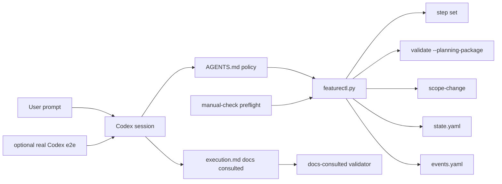

# Architecture: Manual Check Readiness Controls

## Change Delta

This change adds missing control-plane commands and validation modes needed
before manual checking. It keeps existing wrappers and artifact paths stable,
but adds explicit state-transition, scope-change, planning-package validation,
docs-consulted proof, optional real Codex e2e scaffolding, and preflight
coverage.

## System Context

The Native Feature Pipeline is file-backed. `featurectl.py` mutates machine
state and deterministic artifacts, `nfp-*` skills write narrative planning and
review content, and `.ai/knowledge` gives future agents retrieval context.

`events.yaml` is already the machine event source of truth. This feature makes
that role explicit in docs and command behavior.

## Component Interactions

`featurectl_core/cli.py` receives new `step set` and `scope-change` command
handlers. Those handlers update `state.yaml`, append narrative summaries to
`execution.md`, and append structured records to `events.yaml`.

`featurectl_core/validation.py` gains a planning-package path that checks
artifact completeness without requiring implementation permission. Docs-consulted
validation becomes source-backed by inspecting real paths in `execution.md`.

Tests cover command behavior, skill contracts, optional real Codex e2e
scaffolding, and manual preflight.

## Feature Topology

Manual checking becomes a three-layer validation process:

1. Deterministic unit tests validate commands, artifacts, and validators.
2. Manual preflight validates a concrete workspace before a human run.
3. Optional real Codex e2e validates natural prompt behavior when enabled.

## Diagrams

## Security Model

No credentials are added. Real Codex e2e is explicitly opt-in through
environment variables and runs in a temporary fixture repository. Public raw
checks still fetch text only and do not execute remote content.

## Failure Modes

- Invalid state transition: `step set` rejects the target and leaves state
  unchanged.
- Planning package incomplete: `validate --planning-package` reports missing
  artifacts or weak docs-consulted proof.
- Scope change after implementation starts: stale flags block implementation
  until returned artifacts are updated and gates are re-approved.
- Real Codex unavailable: optional tests skip with a clear reason.

## Observability

State transitions and scope changes appear in `execution.md` summaries and
`events.yaml`. Real e2e runs capture `prompt.md`, `codex-output.log`,
`workspace-tree.txt`, `git-diff.patch`, `featurectl-status.log`, and
`featurectl-validate.log`.

## Rollback Strategy

Each slice can be reverted independently. Removing new commands restores the
previous command set. Planning-package validation can be removed without
affecting `--implementation`. Optional real e2e tests do not affect default CI.

## Migration Strategy

No existing feature workspaces need migration. New commands and validations
apply to future manual-check runs. Historical docs-consulted sections can remain
legacy unless their gates are revalidated.

## Architecture Risks

- Over-strict docs-consulted validation could break old fixtures, so tests and
  helper artifacts must be updated together.
- Step transition rules should be strict enough to prevent invalid jumps but not
  block legitimate recovery.
- Scope-change stale mapping must not silently clear existing stale flags.

## Alternatives Considered

- Let skills keep editing `state.yaml` directly: rejected because `AGENTS.md`
  requires machine state mutation through `featurectl.py`.
- Remove `events.yaml`: rejected because recent guardrails rely on structured
  event history and validation.
- Make real Codex e2e part of default CI immediately: rejected because it is
  environment-dependent and may require credentials or local tooling.

## Shared Knowledge Impact

Promotion should update:

- `.ai/knowledge/architecture-overview.md` with step/scope/readiness flow.
- `.ai/knowledge/module-map.md` with new command and validator ownership.
- `.ai/knowledge/integration-map.md` with manual preflight and real e2e modes.
- `.ai/knowledge/testing-overview.md` with the test matrix.
- `.ai/knowledge/contracts-overview.md` with review artifact and event-source
  contracts.

## Completeness Correctness Coherence

The change directly addresses the manual-check blockers from the review. It
separates planning quality from implementation permission, removes manual state
editing pressure, makes scope recovery operational, and introduces explicit real
Codex e2e scaffolding without destabilizing default tests.

## ADRs

- ADR-010 records official machine event, step transition, planning-package, and
  manual-check preflight policy.
