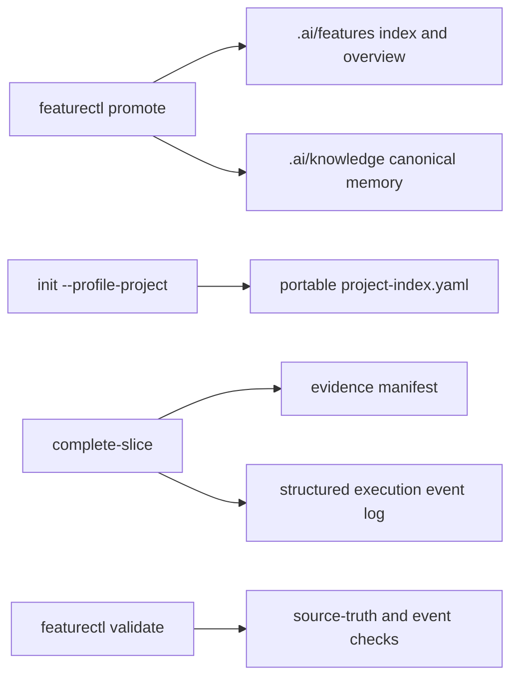

# Architecture: Portable Artifact Consistency

## Overview

This pass strengthens the same control plane as the previous feature. The main
behavior remains in `featurectl.py`; tests codify synchronization, portability,
event schema, evidence metadata, and source readability rules.

## Change Delta

Existing artifacts are migrated in place; no new runtime service is introduced.

## System Context

The pipeline is a file-based control plane inside the repository. Agents read
`.ai/knowledge`, mutate feature workspaces, and promote finished features into
`.ai/features`.

## Component Interactions

## Feature Topology

`featurectl.py` updates machine-readable state and validation; skills write
narrative artifacts; tests verify contracts; knowledge files become retrieval
context for future runs.

## Diagrams

See the Mermaid topology above.

## Security Model

No credentials, secrets, or network permissions are added.

## Failure Modes

- Canonical memory can drift from `.ai/knowledge`.
- Unstructured events can hide duplicate slice completions.
- Semantic labels in `diff_hash` can be misread as real hashes.

## Observability

Failures surface through deterministic validation messages and pytest
regressions.

## Rollback Strategy

Revert the feature commits and restore migrated artifacts from git history.

## Migration Strategy

Mechanically update existing execution logs, evidence manifests, knowledge
files, and worktree paths.

## Architecture Risks

Stricter validation can block promotion until legacy artifacts are migrated.

## Alternatives Considered

- Keep legacy `completed slice` prose events. Rejected because tooling cannot
  reliably reason over mixed event schemas.
- Keep absolute profile roots. Rejected because shared knowledge must be
  portable.

## Completeness Correctness Coherence

Each requirement has a corresponding validation or formatting test, and final
promotion validates both canonical and source workspace copies.

## ADRs

No new ADR is required; this pass applies and enforces the ADRs created by the
previous artifact-readability feature.

## Shared Knowledge Impact

- `.ai/knowledge/features-overview.md` becomes synchronized with canonical
  feature memory.
- `.ai/knowledge/project-index.yaml` stores `root: .` and includes all canonical
  feature keys.
- `.ai/knowledge/discovered-signals.md` separates canonical reason from
  noncanonical rationale.

## Risks

- Stricter event validation can fail old canonical runs unless migration updates
  all active event logs.
- Evidence metadata migration must not remove useful semantic labels; it moves
  them to `change_label`.
