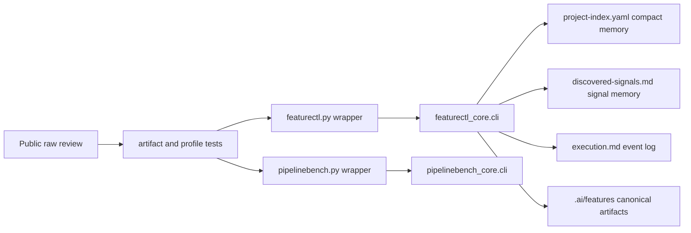

# Architecture: Public Raw Artifact Guardrails

## Change Delta

The change adds stronger validation around existing pipeline artifacts and
narrows generated project memory. It keeps public CLIs stable while enforcing
clean-checkout behavior through tests and deterministic featurectl output.

## System Context

`featurectl.py` and `pipelinebench.py` are stable wrappers under
`.agents/pipeline-core/scripts`. Their implementation modules remain
`featurectl_core.cli` and `pipelinebench_core.cli`. Project knowledge under
`.ai/knowledge/` feeds context discovery and must stay readable, compact, and
source-scoped.

## Component Interactions

- `featurectl_core.cli` generates project index, discovered signals, profile
  examples, execution events, evidence manifests, and promotion memory.
- `tests/feature_pipeline/test_artifact_formatting.py` validates wrappers,
  `.gitignore`, Python sources, and curated/canonical artifacts.
- `tests/feature_pipeline/test_featurectl_core.py` validates project-profile
  separation and discovered signal rendering.
- `tests/feature_pipeline/test_gates_and_evidence.py` validates event output
  for gates and slice completions.
- `tests/feature_pipeline/test_finish_promote.py` validates promotion event and
  current-run-state semantics.

## Feature Topology

## Diagrams

The Mermaid topology above shows the high-level flow from public-review claims
to deterministic guards and generated artifacts.

## Security Model

No secrets, credentials, network calls, or external services are introduced.
Tests run local scripts and read local files only.

## Failure Modes

- Wrapper execution can silently regress if tests only inspect source text.
- Project-index compaction can break callers that still expect feature signals
  in the index.
- Event rendering can break legacy validation if old prose events are not
  tolerated where appropriate.
- Broad readability scans can overreach into raw evidence logs unless scoped.

## Observability

Failures appear through pytest output, featurectl validation blockers, and final
verification logs under the feature workspace evidence directory.

## Rollback Strategy

Revert the feature branch commits. The rollback restores the previous
project-index shape and event rendering while leaving prior canonical memory
intact.

## Migration Strategy

Regenerate `.ai/knowledge/project-index.yaml`,
`.ai/knowledge/discovered-signals.md`, and `.ai/knowledge/profile-examples.yaml`
with the compact profile model. Promote the completed feature so the canonical
run memory records the new event and readability contracts.

## Architecture Risks

- Keeping discovered signals only in Markdown reduces machine-read convenience
  but lowers accidental misuse of low-confidence data.
- Key-value Markdown events are easier to migrate now than YAML event blocks,
  but are less structured than a future event schema file.

## Alternatives Considered

- Treat public raw findings as fully stale and make no changes. Rejected
  because stale findings revealed insufficient guard coverage.
- Keep feature signals in `project-index.yaml`. Rejected because the context
  skill should read canonical project memory before low-confidence leads.

## Shared Knowledge Impact

- `.ai/knowledge/project-index.yaml` becomes a compact first-pass context file.
- `.ai/knowledge/discovered-signals.md` becomes the only low-confidence signal
  map.
- `.ai/knowledge/architecture-overview.md` remains the high-level control-plane
  topology and must use `evidence/`, not `evidence//`.

## Completeness Correctness Coherence

Each review finding maps to either a disproving test, a generator change, or an
explicitly scoped exemption. The feature avoids broad historical rewrites except
where regenerated project knowledge is the source of truth.

## ADRs

No new ADR is required. The feature card will record the project-index
compaction and event-shape decisions as feature memory.
