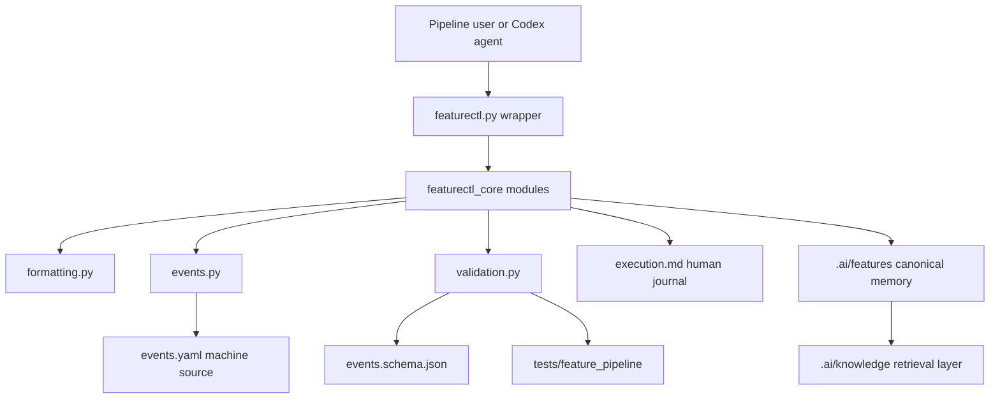

# Architecture: Raw Schema And Execution Boundary Hardening

## Change Delta

- New behavior: `events.yaml` gains a JSON schema and workspace validation.
- New behavior: formatting helper error paths are covered and Unicode YAML is
  written as readable Unicode.
- Modified behavior: apex read order lists `events.yaml` before evidence.
- Modified behavior: canonical completed implementation gates are normalized to
  `complete`.
- Unchanged behavior: stable CLI wrappers and existing command names remain the
  public interface.
- Removed behavior: none.

## System Context

The feature operates inside the repository-local pipeline control plane.
`featurectl.py` delegates to `featurectl_core`, which owns YAML IO, event
sidecars, validation, workspace creation, and promotion. Tests under
`tests/feature_pipeline` provide deterministic offline guardrails.

## Component Interactions

- `featurectl_core.formatting` reads and writes YAML for all machine artifacts.
- `featurectl_core.events` creates and updates `events.yaml`.
- `featurectl_core.validation` validates state, evidence, execution, source
  truth, and now event sidecar shape.
- `.agents/pipeline-core/scripts/schemas/events.schema.json` documents the
  machine event contract.
- `tests/feature_pipeline` proves behavior without network dependency.

## Feature Topology

## Diagrams

The topology diagram shows the feature from wrapper entrypoint through YAML IO,
event sidecar ownership, validation, and canonical memory.

## Security Model

No secrets, credentials, network services, or permissions are added. Schema
validation and formatting fixes run only on local repository files.

## Failure Modes

- Missing `FeatureCtlError` import could mask expected validation failures as
  runtime crashes.
- Missing event schema could let future agents generate incompatible
  `events.yaml` records.
- Duplicate machine event logs could confuse source-of-truth decisions if
  `execution.md` and `events.yaml` are not clearly separated.
- Overly strict legacy validation could break older canonical features.

## Observability

Failures surface through pytest, `featurectl.py validate`, and evidence logs
under the feature workspace. Final verification records wrapper smoke,
artifact-formatting tests, and full suite results.

## Rollback Strategy

Revert this feature commit. The changes are local to pipeline scripts, tests,
schemas, and canonical documentation, so rollback does not require data
migration or external cleanup.

## Migration Strategy

Backfill the latest canonical feature artifacts where directly affected:
`core-modularity-and-readable-events` apex, state, execution, and events. Legacy
features without `events.yaml` remain valid unless they are modified by a new
feature run.

## Architecture Risks

- Event validation may become too large inside `validation.py`; this feature
  keeps the validator scoped and leaves broader module extraction as follow-up.
- Event schema may lag implementation if future event types are added without
  tests.

## Alternatives Considered

- Network raw tests in CI: rejected because the normal suite should remain
  deterministic and offline.
- Replace `execution.md` with `events.yaml`: rejected because human-readable
  run journals are still useful.
- Split all validators now: deferred to avoid broad refactor risk.

## Shared Knowledge Impact

### Shared Knowledge Decision Table

| Knowledge file | Decision | Evidence | Future reuse |
| --- | --- | --- | --- |
| `.ai/knowledge/architecture-overview.md` | Update | Event schema and boundary | Future agents see event ownership |
| `.ai/knowledge/module-map.md` | Update | Formatting/events/validation responsibilities | Future fixes target correct module |
| `.ai/knowledge/integration-map.md` | Update | `events.yaml` machine source | Future validators avoid scraping prose |
| `.ai/knowledge/adr-index.md` | Update | event schema/boundary decision | Future decisions can cite the policy |

## Completeness Correctness Coherence

The design ties each review finding to a local module, test, and artifact
boundary. Raw public byte checks are verified manually and locally; deterministic
tests assert the same properties from checked-out files.

## ADRs

Add an ADR for `events.yaml` schema and execution boundary semantics if the
implementation changes event validation behavior.
