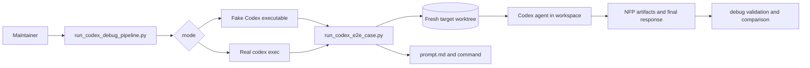
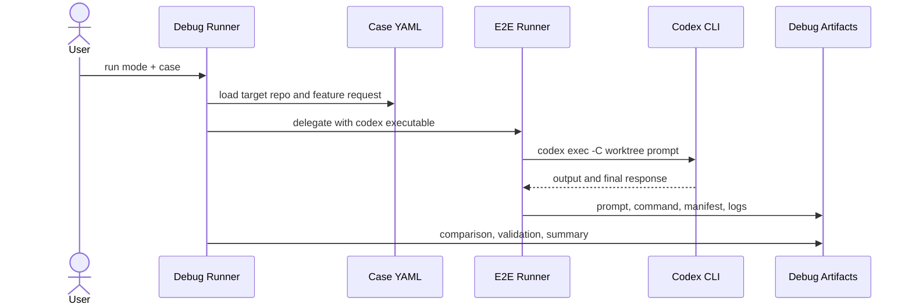

# Architecture: Real Codex Showcase Debug Runner

## Change Delta

- New: debug wrapper for Codex E2E cases with explicit execution mode.
- New: validation and comparison artifacts for mock vs real Codex runs.
- Modified: existing E2E runner records timeout and execution-mode metadata.
- Removed: none.
- Unchanged: fast fake-Codex unit tests continue to guard prompt/command shape.

## System Context

The existing `run_codex_e2e_case.py` already creates a fresh target repository
worktree, installs `AGENTS.md`, `.agents`, `.ai/pipeline-docs`, and `skills`,
then invokes `codex exec -C <worktree> <prompt>`. The gap is that tests only
exercise this path with a fake executable and reports do not make mock vs real
execution obvious.

## Component Interactions

- Test or maintainer calls `run_codex_debug_pipeline.py`.
- Debug runner loads case YAML and chooses `mock`, `dry-run`, or `real`.
- In `mock` mode it writes a temporary fake Codex executable that simulates a
  successful nested run and emits inspection JSON.
- In `real` mode it requires a real Codex binary and delegates to
  `run_codex_e2e_case.py`.
- Existing E2E runner prepares a fresh feature worktree, writes prompt/command
  artifacts, and invokes Codex.
- Debug validator reads the run manifest, prompt, command, final/output logs,
  worktree contents, and generated pipeline artifacts.

## Feature Topology

## Diagrams

## Security Model

Real mode uses `codex exec --dangerously-bypass-approvals-and-sandbox` because
that is how existing showcase runs simulate a fully empowered local agent. The
runner requires explicit `--mode real`, records the exact command, supports a
timeout, and refuses dirty target repos by default.

## Failure Modes

- Real `codex` missing: fail before target worktree preparation.
- Timeout: record non-zero return code and timeout metadata.
- Fake executable accidentally used as real: report `execution_mode: mock`.
- Prompt scripts internal `nfp-*` steps: validation fails.
- Pipeline artifacts missing after successful final claim: validation reports
  artifact weakness.

## Observability

Every debug run writes `summary.yaml`, `comparison.md`, `validation.yaml`,
`validation.md`, `prompt.md`, `codex-command.json`, `codex-output.log`,
`codex-final.txt`, and a replay shell command.

## Rollback Strategy

Generated debug runs live under `pipeline-lab/showcases/codex-debug-runs` and
can be removed without touching target repositories. Existing target worktrees
can be deleted with `git worktree remove --force`.

## Migration Strategy

No data migration.

## Architecture Risks

- Mock results could be mistaken for real Codex behavior if mode metadata is
  missing.
- Real runs can be expensive or slow; timeout and explicit mode reduce surprise.
- Validation must not require real model output in CI.

## Alternatives Considered

- Replace the existing fake test with real Codex: rejected because CI and local
  fast feedback would become slow and environment-dependent.
- Keep only the existing runner: rejected because it does not compare mock vs
  real-capable behavior or validate artifacts as a pipeline debug report.
- Build an interactive TTY driver: deferred because `codex exec` already
  provides a reproducible non-interactive user-to-agent handoff.

## Shared Knowledge Impact

### Shared Knowledge Decision Table

| Knowledge file | Decision | Evidence | Future reuse |
| --- | --- | --- | --- |
| `.ai/knowledge/features-overview.md` | update after promotion with the debug runner as pipeline tooling | feature-card and debug report | future agents know mock tests are not real Codex validation |
| `.ai/knowledge/architecture-overview.md` | update after `/init` with debug runner topology | architecture.md and script path | future pipeline work reuses the mock+real split |
| `.ai/knowledge/module-map.md` | update after `/init` to include new script and tests | project profile counts | future context discovery finds debug runner ownership |
| `.ai/knowledge/integration-map.md` | confirm unchanged; local CLI execution only | no network/service integration added | future agents do not infer a production external integration |

## Completeness Correctness Coherence

- Completeness: covers mode selection, execution, validation, comparison, and
  generated debug artifacts.
- Correctness: keeps deterministic tests separate from optional real Codex
  execution.
- Coherence: reuses the existing E2E runner instead of creating a parallel
  prompt/worktree implementation.

## ADRs

- ADR-001: Keep mock tests and add explicit real-Codex debug mode.
- ADR-002: Treat `codex exec -C <worktree> <prompt>` as the native user-agent
  reproduction boundary.
