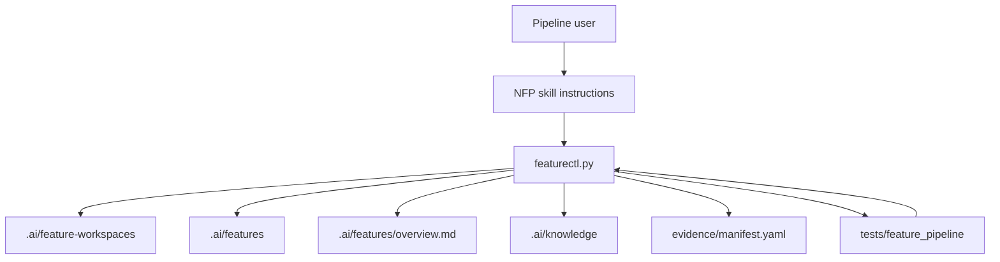

# Architecture: Source Of Truth Hardening

## Change Delta

The validation layer becomes responsible for repository-level source-of-truth
checks in addition to per-workspace artifact checks. Promotion wording and skill
docs are aligned with the actual incoming-variant archive behavior.

## System Context

`featurectl.py` owns deterministic state transitions and validation. The
`.agents/skills/nfp-*` files own user-facing workflow instructions. `.ai`
contains active workspaces, canonical feature memory, generated knowledge, and
reports consumed by future agents.

## Component Interactions

- `featurectl.py validate` reads the workspace, canonical index, canonical
  features, overview, and execution journal.
- `featurectl.py promote` copies a finished workspace into canonical memory,
  updates status, regenerates the index, and appends the promotion event.
- Skill docs tell the host agent how to record fallback and promotion behavior.
- Tests build throwaway repos and assert validation or promotion behavior.

## Feature Topology

## Diagrams

The topology above shows the source-of-truth loop. Validation reads both the
active workspace and canonical memory so drift is caught before future agents
reuse stale state.

## Security Model

No new credential or network behavior is introduced. The validation changes only
read local repository artifacts and write deterministic project profile files
when explicitly invoked through `init`.

## Failure Modes

- False positives on historical workspaces: keep checks narrowly scoped and use
  promoted/archived/read-only states for allowed lifecycle outcomes.
- Generated docs drift: add tests around overview/index synchronization.
- Failed slice completion mutates evidence: validate proposed manifest before
  writing.

## Observability

Validation prints explicit blocker lines. Execution journals use `## Latest
Status` so a future agent can see current step, next recommended skill, blocking
issues, and last update without scanning every event.

## Rollback Strategy

Revert the feature branch or individual commits. The changes do not migrate
external data.

## Migration Strategy

Current generated `.ai/features/overview.md` is updated from the canonical
index. Existing production skill references are rewritten to the canonical
`.agents/pipeline-core/references` root.

## Architecture Risks

- Adding repository-level validation to `validate` could surface old drift. The
  current repo will be repaired as part of this feature.
- The full `featurectl.py` split remains a future maintainability task.

## Alternatives Considered

- Add a separate `validate --canonical-memory` mode. Rejected for this feature
  because normal validation should catch source-of-truth drift by default.
- Delete active workspaces after promotion. Deferred because archival policy
  needs a migration command.

## Shared Knowledge Impact

- `.ai/knowledge/features-overview.md`: regenerated feature picture should keep
  canonical features separate from generated benchmark signals.
- `.ai/knowledge/architecture-overview.md`: records validation as the source of
  canonical consistency.
- `.ai/knowledge/module-map.md`: continues to identify `.agents`, `.ai`,
  `pipeline-lab`, and `tests` as major boundaries.
- `.ai/knowledge/integration-map.md`: no external integration changes.

## Completeness Correctness Coherence

The design covers the direct findings that are small enough to make reliable in
one feature: canonical consistency, lifecycle validation, execution status,
atomic evidence completion, skill source references, fallback policy, promotion
wording, and generated-output filtering.

## ADRs

- ADR-001: Keep validation in `featurectl.py validate` rather than a separate
  command for v1.
- ADR-002: `archive-as-variant` archives the incoming workspace and never
  modifies the existing canonical feature.
