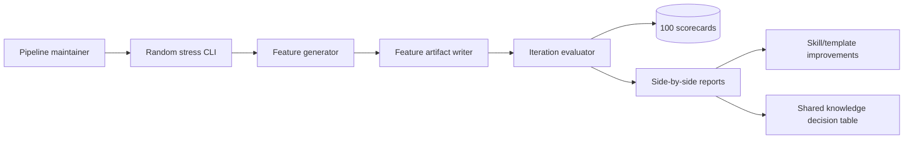
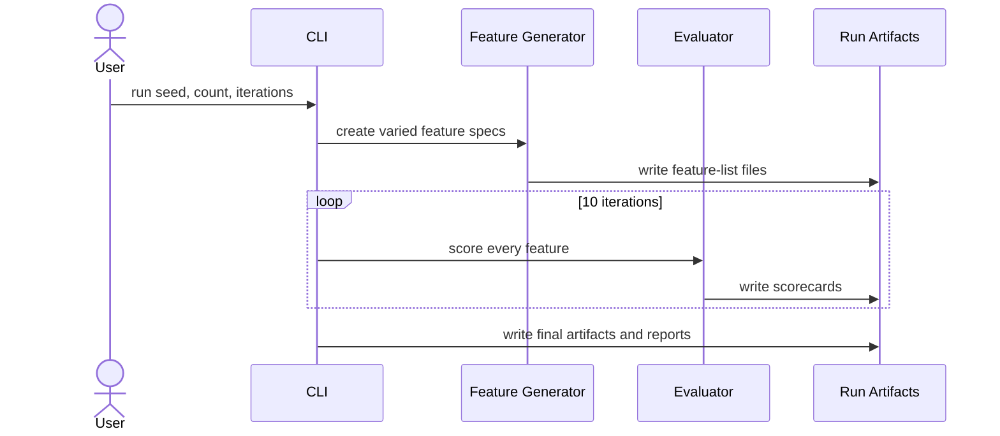

# Architecture: Random Feature Stress Lab

## Change Delta

- New: `run_random_feature_stress.py` deterministic stress runner.
- New: tests that assert ten features, ten iterations, shared-knowledge quality,
  and no open final improvements.
- Modified: architecture and finish skills/templates require shared-knowledge
  decision tables rather than generic path bullets.
- Removed: none.
- Unchanged: existing native emulation, real showcase, and Codex E2E runners.

## System Context

The lab sits in `pipeline-lab/showcases/scripts` and produces reviewable run
artifacts under `pipeline-lab/showcases/random-feature-stress-runs`. It reads
only repository-local skill and knowledge files, then writes deterministic
feature artifacts and scorecards for the harness repository.

## Component Interactions

- CLI runner parses seed, feature count, iteration count, and output paths.
- Feature generator samples repository areas, complexities, risks, and changed
  surfaces.
- Artifact writer creates final feature outputs per generated feature.
- Iteration evaluator records per-feature scorecards across ten rounds.
- Summary renderer writes side-by-side comparison, improvement plan, rollback
  plan, and machine-readable summary.
- Unit tests execute the runner in a temp directory and inspect the generated
  artifacts.

## Feature Topology

## Diagrams

## Security Model

The runner is offline and writes only to the configured output directory. It
does not execute generated commands, access secrets, mutate external
repositories, or contact network services.

## Failure Modes

- Fewer than ten features or iterations should fail with a clear error.
- Missing shared-knowledge table fields should produce open improvements.
- Non-deterministic output would make comparisons noisy and should be caught by
  repeated test runs.

## Observability

The summary records seed, feature count, iteration count, total scorecards,
common mistakes, applied improvements, open improvements, and per-feature final
scores. Reports are Markdown for review and YAML for tests.

## Rollback Strategy

Generated stress outputs are under a dedicated run directory and can be removed
without touching source code. No target repository reset is required because the
lab does not mutate cloned showcase repositories.

## Migration Strategy

No data migration. The change is additive and test-backed.

## Architecture Risks

- Generated artifacts could become too generic unless validation checks concrete
  shared-knowledge decisions.
- A deterministic offline lab could be mistaken for real implementation in OSS
  repositories unless reports explicitly state the harness-only scope.
- Large generated output could make commits noisy; final artifacts are compact
  and scorecards are machine-readable.

## Alternatives Considered

- Extend the existing native emulation runner: rejected because that path is
  optimized for three curated features from `features.md`.
- Drive ten real repos through Codex CLI in this change: deferred because the
  current gap is reproducible pipeline-output quality inside the harness.
- Add only tests without generated reports: rejected because the user needs
  side-by-side comparison artifacts.

## Shared Knowledge Impact

| Knowledge file | Decision | Evidence | Future reuse |
| --- | --- | --- | --- |
| `.ai/knowledge/features-overview.md` | confirm unchanged by this tooling feature; generated stress features remain lab outputs, not product features | stress summary and final report | future agents can find the lab from pipeline/showcase docs instead of promoted product memory |
| `.ai/knowledge/architecture-overview.md` | update after `/init` to reflect new showcase script/test source counts | `featurectl.py init --profile-project` output | future architecture work sees the lab as part of showcase validation tooling |
| `.ai/knowledge/module-map.md` | update after `/init` to include new script/test weighting | `featurectl.py init --profile-project` output | future context discovery sees `pipeline-lab` and `tests` ownership accurately |
| `.ai/knowledge/integration-map.md` | confirm unchanged; no external integration added | stress runner offline design | future work does not infer network or target-repo mutation behavior |

## Completeness Correctness Coherence

- Completeness: the runner covers generation, repeated scoring, shared knowledge,
  reports, rollback notes, tests, and final validation.
- Correctness: deterministic seed and hard minimums prevent under-sized runs.
- Coherence: the lab complements, rather than replaces, existing real-repo E2E
  runners.

## ADRs

- ADR-001: Keep the random stress lab deterministic and offline.
- ADR-002: Require shared-knowledge decision tables in architecture and finish
  outputs to prevent generic path-only updates.
