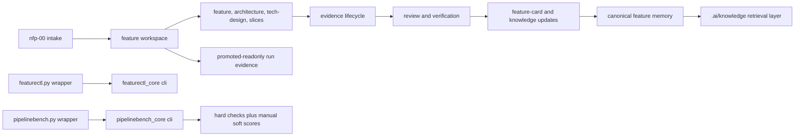

# Architecture Overview

Status: curated
Confidence: medium
Needs human review: yes
Last reviewed: 2026-05-12

## Control Plane

The Native Feature Pipeline control plane exposes a stable wrapper at
`.agents/pipeline-core/scripts/featurectl.py`. The implementation lives in
`.agents/pipeline-core/scripts/featurectl_core/cli.py`. It creates feature
workspaces, tracks gates, records evidence, validates source-of-truth
consistency, updates current run state, and promotes completed feature memory.

`.agents/pipeline-core/scripts/pipelinebench.py` is the stable benchmark
wrapper. The implementation lives in
`.agents/pipeline-core/scripts/pipelinebench_core/cli.py`. It scores completed
workspaces with deterministic hard checks and optional manual soft scores for
skill-quality comparison. Soft-score YAML is local reviewer input and is never
executed.

## Artifact Lifecycle

Feature work starts in a feature workspace under `.ai/feature-workspaces`.
Planning artifacts, execution events, reviews, evidence, and slice status live
there until finish and promotion. Promotion copies the feature workspace into
canonical feature memory under `.ai/features`, updates indexes, and marks the
source workspace as `promoted-readonly`.

## Evidence Lifecycle

Each implementation slice records red, green, verification, and review evidence
under `evidence/<slice-id>/`. `evidence/manifest.yaml` links the files and stores
commit or diff hashes. `complete-slice` validates red-before-green order before
marking a slice complete. Retry completions must be explicit events with attempt
and reason.

## Execution Log Semantics

`execution.md` has one mutable `## Current Run State`, one append-only
`## Event Log`, and one `## History` section. Gate changes, slice completion,
promotion, and retry events belong in the event log. Deprecated `## Latest
Status`, active `## Current Step`, and active `## Next Step` sections are invalid
for finished or promoted work.

## Shared Knowledge Retrieval

Agents should read `.ai/knowledge/features-overview.md` first for canonical
feature memory. `.ai/knowledge/discovered-signals.md` is a source-lead map, not a
product truth layer. Entries with `kind: lab_signal` are only for pipeline-lab,
benchmark, showcase, or validation-tooling work.

## Source Anchors

- `.agents/pipeline-core/scripts/featurectl.py`
- `.agents/pipeline-core/scripts/featurectl_core/cli.py`
- `.agents/pipeline-core/scripts/pipelinebench.py`
- `.agents/pipeline-core/scripts/pipelinebench_core/cli.py`
- `.agents/skills/nfp-01-context/SKILL.md`
- `.ai/features/pipeline/lifecycle-hygiene-profile-noise/architecture.md`
- `.ai/feature-workspaces/pipeline/artifact-readability-execution-semantics--20260512-readability-exec/architecture.md`
