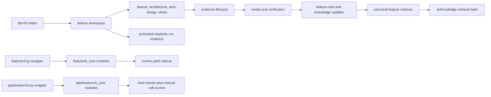

# Architecture Overview

Status: curated
Confidence: medium
Needs human review: yes
Last reviewed: 2026-05-13

## Control Plane

The Native Feature Pipeline control plane exposes a stable wrapper at
`.agents/pipeline-core/scripts/featurectl.py`. The wrapper delegates to focused
modules under `.agents/pipeline-core/scripts/featurectl_core/`:

- `cli.py` owns argument parsing and command dispatch.
- `workspace`, profile, and docset behavior lives in `profile.py` and
  `docsets.py`.
- Gate, validation, evidence, event, and promotion behavior lives in
  `validation.py`, `evidence.py`, `events.py`, and `promotion.py`.
- YAML, Markdown, and shared process helpers live in `formatting.py` and
  `shared.py`.

`.agents/pipeline-core/scripts/pipelinebench.py` is the stable benchmark
wrapper. It delegates to focused modules under `pipelinebench_core/` for
scenarios, scoring, reports, candidate isolation, showcase execution, and
command dispatch. Soft-score YAML is local reviewer input and is never executed.

## Artifact Lifecycle

Feature work starts in a feature workspace under `.ai/feature-workspaces`.
Planning artifacts, execution events, reviews, evidence, and slice status live
there until finish and promotion. Promotion copies the feature workspace into
canonical feature memory under `.ai/features`, updates indexes, and marks the
source workspace as `promoted-readonly`.

## Evidence Lifecycle

Each implementation slice records red, green, verification, and review evidence
under `evidence/<slice-id>/`. `evidence/manifest.yaml` links the files and stores
commit or diff hashes. `complete-slice` validates red-before-green order before
marking a slice complete. Retry completions must be explicit events with attempt
and reason.

## Execution Log Semantics

`execution.md` has one mutable `## Current Run State`, one append-only
`## Event Log`, and one `## History` section. Gate changes, slice completion,
promotion, and retry events belong in the event log. Deprecated `## Latest
Status`, active `## Current Step`, and active `## Next Step` sections are invalid
for finished or promoted work.

New workspaces also include `events.yaml`. This sidecar mirrors parseable event
records from the Markdown event log so validators and benchmarks can consume
event history without scraping prose. `execution.md` remains the human-readable
journal.

## Shared Knowledge Retrieval

Agents should read `.ai/knowledge/features-overview.md` first for canonical
feature memory. `.ai/knowledge/discovered-signals.md` is a source-lead map, not a
product truth layer. Entries with `kind: lab_signal` are only for pipeline-lab,
benchmark, showcase, or validation-tooling work.

`project-index.yaml` is intentionally compact. It stores repo metadata, counts,
module directories, scripts, package manifests, and canonical feature references.
Verbose examples and low-confidence feature signals belong in
`profile-examples.yaml` and `discovered-signals.md` so first-pass context does
not confuse source leads with durable architecture memory.

## Public Raw Guardrails

Wrapper entrypoints must be validated by executing their commands, not by source
text inspection alone. Source-controlled canonical YAML, Markdown, `.gitignore`,
and Python files are guarded against collapsed one-line serialization. Raw
command-output evidence logs remain exempt because they preserve command output
rather than curated documentation.

## Source Anchors

- `.agents/pipeline-core/scripts/featurectl.py`
- `.agents/pipeline-core/scripts/featurectl_core/`
- `.agents/pipeline-core/scripts/pipelinebench.py`
- `.agents/pipeline-core/scripts/pipelinebench_core/`
- `.agents/skills/nfp-01-context/SKILL.md`
- `pipeline-lab/showcases/scripts/run_init_profile_showcases.py`
- `.ai/features/pipeline/lifecycle-hygiene-profile-noise/architecture.md`
- `.ai/feature-workspaces/pipeline/artifact-readability-execution-semantics--20260512-readability-exec/architecture.md`
