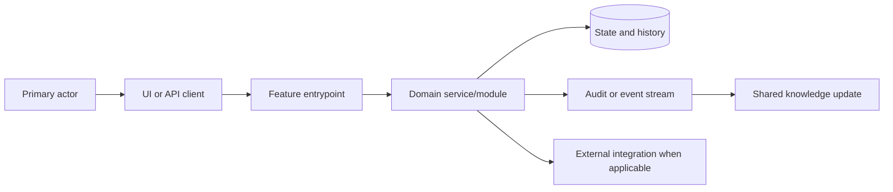
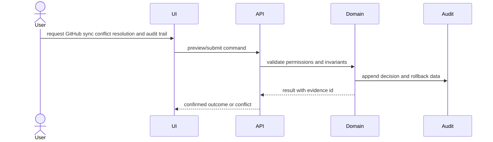

# Architecture: GitHub sync conflict resolution and audit trail

## Change Delta
- New: GitHub sync conflict resolution and audit trail workflow, durable event trail, and verification evidence.
- Modified: nearest domain service, API/UI entry point, and test surfaces identified during context.
- Removed: none assumed before live source inspection.
- Unchanged: unrelated repository workflows and permission boundaries.

## System Context
The feature is modeled as a change set around Plane domain state, API/UI entry points, persistence, audit events, and verification evidence.

## Component Interactions
- GitHub sync state model and conflict detector
- Conflict preview API and resolution command
- Webhook/API stale-event handling and retry-safe audit events
- Issue activity UI for conflict resolution history

## Feature Topology

## Diagrams

## Security Model
- Permission checks happen before preview, mutation, and rollback.
- Destructive operations require explicit confirmation and audit identity.
- External payloads, if any, require replay protection and stale-event checks.

## Failure Modes
- Replay or stale GitHub webhook overwrites newer Plane issue state.
- Ambiguous source-of-truth policy creates sync loops.
- Audit trail misses external actor and payload identity.

## Rollback Strategy
Persist enough before/after state and relation movement metadata to replay or compensate the operation safely.

## Migration Strategy
Deploy persistence and feature flag first, backfill or index audit records where required, then enable the user workflow after verification.

## ADRs
- ADR-001: Use append-only audit events for safety-critical state transitions.
- ADR-002: Block promotion until verification evidence covers every accepted requirement.

## Alternatives Considered
- Reuse existing domain event table directly; acceptable only if it can store rollback payloads and actor provenance.
- Add a feature-specific audit table; safer when existing events cannot preserve before/after state.
- Ship UI-only preview first; rejected for production because apply and rollback invariants must be designed together.

## Shared Knowledge Impact
- `.ai/knowledge/features-overview.md`: add completed feature memory and current behavior summary.
- `.ai/knowledge/architecture-overview.md`: add the high-level topology and affected module boundaries.
- `.ai/knowledge/module-map.md`: update ownership and source/test touchpoints selected by implementation.
- `.ai/knowledge/integration-map.md`: update integration, job, webhook, audit, or external contract paths.

## Completeness Correctness Coherence
- Completeness: every requirement has an architecture component and rollback path.
- Correctness: permissions, audit, and stale/replay controls protect unsafe transitions.
- Coherence: modules align with repository context and defer exact names to source inspection.
