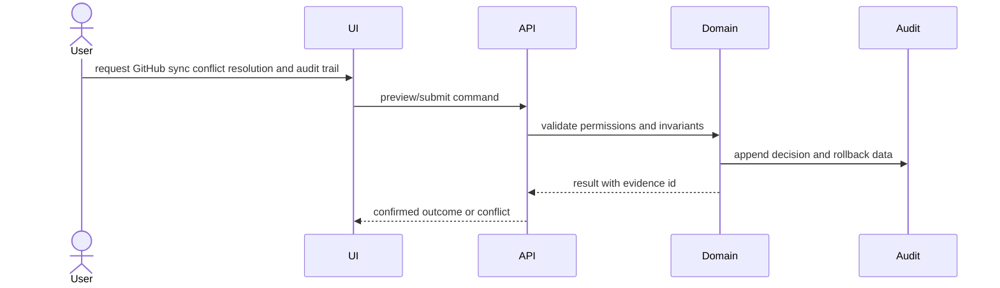

# Architecture: GitHub sync conflict resolution and audit trail

## System Context
The feature is modeled as a change set around Plane domain state, API/UI entry points, persistence, audit events, and verification evidence.

## Component Interactions
- GitHub sync state model and conflict detector
- Conflict preview API and resolution command
- Webhook/API stale-event handling and retry-safe audit events
- Issue activity UI for conflict resolution history

## Diagrams

## Security Model
- Permission checks happen before preview, mutation, and rollback.
- Destructive operations require explicit confirmation and audit identity.
- External payloads, if any, require replay protection and stale-event checks.

## Failure Modes
- Replay or stale GitHub webhook overwrites newer Plane issue state.
- Ambiguous source-of-truth policy creates sync loops.
- Audit trail misses external actor and payload identity.

## Rollback Strategy
Persist enough before/after state and relation movement metadata to replay or compensate the operation safely.

## ADRs
- ADR-001: Use append-only audit events for safety-critical state transitions.
- ADR-002: Block promotion until verification evidence covers every accepted requirement.
