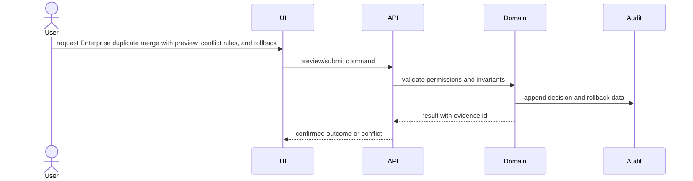

# Architecture: Enterprise duplicate merge with preview, conflict rules, and rollback

## System Context
The feature is modeled as a change set around Twenty domain state, API/UI entry points, persistence, audit events, and verification evidence.

## Component Interactions
- Company duplicate candidate service and normalized matching query
- Merge preview API with conflict policy and related-record impact model
- Transactional merge command with audit event and rollback payload
- CRM UI preview, confirmation, and audit-history surface

## Diagrams

## Security Model
- Permission checks happen before preview, mutation, and rollback.
- Destructive operations require explicit confirmation and audit identity.
- External payloads, if any, require replay protection and stale-event checks.

## Failure Modes
- Irreversible data loss from overwriting company fields without a field provenance record.
- Unsafe automation merging low-confidence duplicates.
- Broken relations if child records are reparented outside a transaction.

## Rollback Strategy
Persist enough before/after state and relation movement metadata to replay or compensate the operation safely.

## ADRs
- ADR-001: Use append-only audit events for safety-critical state transitions.
- ADR-002: Block promotion until verification evidence covers every accepted requirement.
