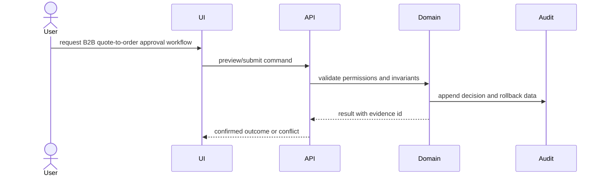

# Architecture: B2B quote-to-order approval workflow

## Change Delta
- New: B2B quote-to-order approval workflow workflow, durable event trail, and verification evidence.
- Modified: nearest domain service, API/UI entry point, and test surfaces identified during context.
- Removed: none assumed before live source inspection.
- Unchanged: unrelated repository workflows and permission boundaries.

## System Context
The feature is modeled as a change set around Medusa domain state, API/UI entry points, persistence, audit events, and verification evidence.

## Component Interactions
- Quote aggregate/state machine and approval policy
- Pricing lock snapshot for promotions, tax, shipping, and totals
- Approval APIs and workflow jobs for buyer, company admin, and merchant
- Quote-to-order conversion command with expiry and audit events

## Diagrams

## Security Model
- Permission checks happen before preview, mutation, and rollback.
- Destructive operations require explicit confirmation and audit identity.
- External payloads, if any, require replay protection and stale-event checks.

## Failure Modes
- Price drift between quote approval and order conversion.
- Incorrect actor authorization across buyer, company admin, and merchant roles.
- Expired quote converted after inventory, tax, or shipping assumptions changed.

## Rollback Strategy
Persist enough before/after state and relation movement metadata to replay or compensate the operation safely.

## Migration Strategy
Deploy persistence and feature flag first, backfill or index audit records where required, then enable the user workflow after verification.

## ADRs
- ADR-001: Use append-only audit events for safety-critical state transitions.
- ADR-002: Block promotion until verification evidence covers every accepted requirement.

## Alternatives Considered
- Reuse existing domain event table directly; acceptable only if it can store rollback payloads and actor provenance.
- Add a feature-specific audit table; safer when existing events cannot preserve before/after state.
- Ship UI-only preview first; rejected for production because apply and rollback invariants must be designed together.

## Completeness Correctness Coherence
- Completeness: every requirement has an architecture component and rollback path.
- Correctness: permissions, audit, and stale/replay controls protect unsafe transitions.
- Coherence: modules align with repository context and defer exact names to source inspection.
