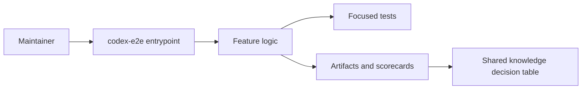

# Architecture: Policy-Aware Nested prompt policy verifier

## System Context
This feature targets `codex-e2e` with complexity `8`.

## Component Interactions
- CLI/user request enters the harness runner or skill.
- Domain logic updates the target module.
- Validation records evidence and shared-knowledge decisions.

## Feature Topology

## Shared Knowledge Decision Table
| Knowledge file | Decision | Evidence | Future reuse |
| --- | --- | --- | --- |
| `.ai/knowledge/features-overview.md` | update after promotion with `Policy-Aware Nested prompt policy verifier` as validated lab behavior | feature-card.md and summary.yaml | future agents can discover the feature pattern without reading every scorecard |
| `.ai/knowledge/architecture-overview.md` | update topology notes for `codex-e2e` when promoted | architecture.md Mermaid topology | future architecture work can reuse affected module communication |
| `.ai/knowledge/module-map.md` | update changed surfaces: prompt.md, run_codex_e2e_case.py, codex-output.log | repo-context.md and slices.yaml | future slicing can reuse ownership and conflict-risk hints |
| `.ai/knowledge/integration-map.md` | confirm unchanged unless external integration appears during live implementation | tech-design.md security and integration notes | future agents do not infer an external dependency from this lab output |

## Security Model
No secrets, network calls, or external repository mutation are required.

## Failure Modes
- policy bypass
- chat-only state
- missing worktree policy

## Rollback Strategy
Remove generated artifacts for `03-policy-aware-nested-prompt-policy-verifier` and revert source changes for `codex-e2e`.
