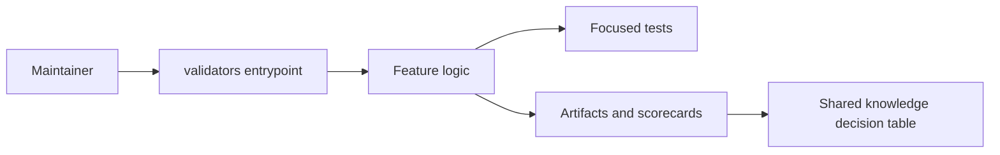

# Architecture: Guided Shared knowledge coverage gate

## System Context
This feature targets `validators` with complexity `9`.

## Component Interactions
- CLI/user request enters the harness runner or skill.
- Domain logic updates the target module.
- Validation records evidence and shared-knowledge decisions.

## Feature Topology

## Shared Knowledge Decision Table
| Knowledge file | Decision | Evidence | Future reuse |
| --- | --- | --- | --- |
| `.ai/knowledge/features-overview.md` | update after promotion with `Guided Shared knowledge coverage gate` as validated lab behavior | feature-card.md and summary.yaml | future agents can discover the feature pattern without reading every scorecard |
| `.ai/knowledge/architecture-overview.md` | update topology notes for `validators` when promoted | architecture.md Mermaid topology | future architecture work can reuse affected module communication |
| `.ai/knowledge/module-map.md` | update changed surfaces: validate_pipeline_goals.py, architecture.md, feature-card.md | repo-context.md and slices.yaml | future slicing can reuse ownership and conflict-risk hints |
| `.ai/knowledge/integration-map.md` | confirm unchanged unless external integration appears during live implementation | tech-design.md security and integration notes | future agents do not infer an external dependency from this lab output |

## Security Model
No secrets, network calls, or external repository mutation are required.

## Failure Modes
- generic knowledge bullets
- future agent confusion

## Rollback Strategy
Remove generated artifacts for `07-guided-shared-knowledge-coverage-gate` and revert source changes for `validators`.
